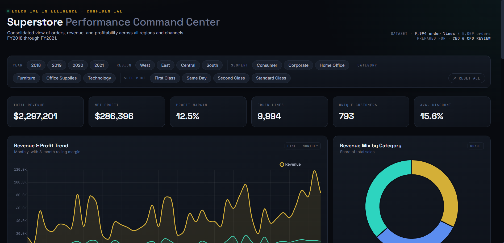

# 📊 Executive Sales Dashboard

> An interactive, dark-themed business intelligence dashboard built for C-suite decision-making — designed for CEOs and CFOs to explore revenue, profitability, and customer insights in real time.

🔗 **Live Demo:** [https://armaan24905.github.io/executive-sales-dashboard/]([https://github.com/armaan24905/executive-sales-dashboard.git])
*(will be live once GitHub Pages is enabled on the repo)*



---

## 🚀 Overview

This project transforms a raw, order-level sales dataset (9,994 records spanning 2018–2021) into a fully interactive executive reporting tool. Instead of static charts, every KPI, chart, and insight on the page recalculates live as filters are applied — replicating the kind of BI experience used in real enterprise reporting tools like Power BI or Tableau, built entirely from scratch with vanilla JavaScript and Chart.js.

## ✨ Key Features

- **10+ interactive visualizations** — revenue/profit trends, category mix, regional performance, sub-category profitability, discount-vs-profit correlation, and more
- **Live cross-filtering** — filter by Year, Region, Segment, Category, and Ship Mode; every chart, KPI, and table updates instantly from the underlying data
- **Auto-generated insights panel** — plain-English, boardroom-style takeaways that regenerate dynamically based on the current filter selection
- **Ranked data tables** — top-performing cities and customers with inline visual indicators
- **Fully self-contained** — single HTML file, no server or internet dependency required, opens instantly in any browser
- **Custom dark UI system** — gold/teal accent palette with a dedicated type system (display, body, and monospace faces) designed to feel financial-grade, not templated

## 🛠️ Tech Stack

| Layer | Technology |
|---|---|
| Visualization | Chart.js |
| Structure & Logic | HTML5, CSS3, Vanilla JavaScript |
| Data Processing | Python (pandas) for source data preparation |
| Design System | Custom CSS — Space Grotesk / Inter / JetBrains Mono |

## 📈 Dataset

- **9,994** order-line records | **5,009** unique orders | **793** customers
- **4 years** of transactional data (2018–2021)
- Dimensions: Region, Segment, Category, Sub-Category, State, City, Ship Mode
- Metrics: Sales, Profit, Quantity, Discount

## 📂 Project Structure

```
executive-sales-dashboard/
├── index.html          # Complete dashboard (self-contained)
├── screenshot.png       # Preview image
└── README.md
```

## ⚙️ Running Locally

No build step, no dependencies to install — just open the file:

```bash
git clone https://github.com/armaan24905/executive-sales-dashboard.git
cd executive-sales-dashboard
open index.html        # or double-click the file
```

## 💡 What This Project Demonstrates

- Translating raw tabular data into a decision-ready visual narrative
- Designing information hierarchy for a non-technical, executive audience
- Building real-time, client-side data filtering and aggregation logic from scratch
- Applying intentional visual design systems (color, type, layout) rather than default styling

---

## 👤 About the Developer

**Armaan Khan**
💻 B.Tech, Artificial Intelligence & Data Science 🚀✨

Passionate about building AI/ML-driven and data-focused projects that bridge technical engineering with real-world business impact 🌍. Actively exploring machine learning 🧠, data visualization 📊, and full-stack development.

📫 Connect with me on [LinkedIn](https://www.linkedin.com/in/armaan-saad-120251306?utm_source=share_via&utm_content=profile&utm_medium=member_android) | 💻 [GitHub](https://github.com/armaan24905)

---

*⭐ If you find this project useful or interesting, consider giving it a star!*
